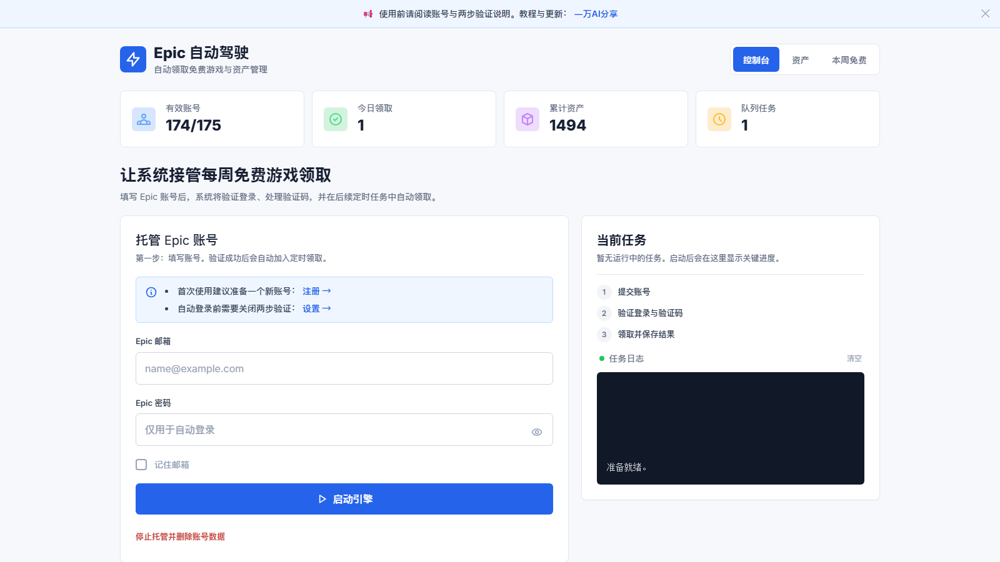

# Epic Kiosk

[](https://blog.910501.xyz/)
[](https://space.bilibili.com/59438380)
[](https://www.youtube.com/channel/UCqgvZnCN9-9pZcL4SWxmnDw)


Epic Kiosk 是一个基于 Docker 的 Epic Games 每周免费游戏自动领取服务，支持多账号托管、验证码自动处理、队列调度和多 WARP 出口。

> 公益站点：[https://epic.910501.xyz/](https://epic.910501.xyz/)

<p align="center">
  
</p>

## 特性

- **多账号托管**：在 Web 控制台提交 Epic 邮箱和密码，后续由 Worker 自动处理登录与领取。
- **验证码处理**：默认使用 SiliconFlow 三模型链，支持会话降级、跨任务熔断和外部验证码服务商兜底。
- **多游戏流程**：只有本周期全部周免均确认 `claimed/owned` 才会标记账号完成，失败项会延迟补跑。
- **周期调度**：Web 每小时检查当前周免集合；新周期按 5 个账号一批、每批间隔 10 分钟；周期内新增账号会自动补排，同周期已完成账号不会重复领取。
- **登录与领取分离**：托管账号时只验证登录并保存账号，实际领取由后续周免周期任务执行。
- **多 WARP 出口**：单个 `epic-warp` 容器提供 10 个内部 WARP 实例，Worker 按账号稳定分配代理出口。
- **Docker 部署**：`web`、`worker`、`redis`、`warp` 四个服务通过 Docker Compose 本地构建和运行。

## 快速开始

### 手动部署（推荐）

默认推荐 SiliconFlow，也兼容 NVIDIA 和其他 OpenAI-compatible API 提供商。

```bash
git clone https://github.com/10000ge10000/epic-kiosk.git
cd epic-kiosk
cp .env.example .env
nano .env
```

创建仓库外 Secret 目录和文件：

```bash
sudo install -d -m 0700 -o 1002 -g 1002 /etc/epic-kiosk/secrets
sudo install -m 0600 -o 1002 -g 1002 /dev/null /etc/epic-kiosk/secrets/captcha_nvidia_api_key
sudo install -m 0600 -o 1002 -g 1002 /dev/null /etc/epic-kiosk/secrets/captcha_siliconflow_api_key
sudo nano /etc/epic-kiosk/secrets/captcha_nvidia_api_key
sudo nano /etc/epic-kiosk/secrets/captcha_siliconflow_api_key
```

生成内部接口令牌和 Fernet 凭据密钥：

```bash
openssl rand -hex 32 | sudo tee /etc/epic-kiosk/secrets/internal_api_token >/dev/null
openssl rand -base64 32 | tr '+/' '-_' | tr -d '\n' | sudo tee /etc/epic-kiosk/secrets/epic_credential_keys >/dev/null
sudo chown 1002:1002 /etc/epic-kiosk/secrets/*
sudo chmod 0600 /etc/epic-kiosk/secrets/*
```

启动服务：

```bash
docker compose up -d --build
```

访问控制台：

```text
http://服务器IP:18000
```

### Linux 安装脚本

仓库授权用户完成克隆后，可以运行交互式安装脚本。脚本默认按 SiliconFlow 兼容配置引导；如果使用 NVIDIA 或自定义 OpenAI-compatible 服务，建议使用上面的手动部署流程。

```bash
chmod +x install.sh
./install.sh
```

## 配置说明

### API Provider

项目通过 OpenAI-compatible `/v1/chat/completions` 接口调用模型。当前默认使用 SiliconFlow；连接超时、429 或 5xx 会按模型链故障转移。

| Provider | API_BASE_URL | 说明 |
| --- | --- | --- |
| `siliconflow` | `https://api.siliconflow.cn/v1` | 当前默认推荐，用于 hCaptcha 视觉识别。 |
| `nvidia` | `https://integrate.api.nvidia.com/v1` | 兼容旧版部署配置。 |
| `custom` | 自定义 `/v1` 地址 | 适合自建 OpenAI-compatible 网关。 |

核心环境变量：

```env
INTERNAL_API_TOKEN_PATH=/etc/epic-kiosk/secrets/internal_api_token
EPIC_CREDENTIAL_KEYS_PATH=/etc/epic-kiosk/secrets/epic_credential_keys
CAPTCHA_NVIDIA_API_KEY_PATH=/etc/epic-kiosk/secrets/captcha_nvidia_api_key
CAPTCHA_SILICONFLOW_API_KEY_PATH=/etc/epic-kiosk/secrets/captcha_siliconflow_api_key
API_PROVIDER=siliconflow
API_BASE_URL=https://api.siliconflow.cn/v1
CAPTCHA_PRIMARY_BASE_URL=https://api.siliconflow.cn/v1
CAPTCHA_PRIMARY_MODEL=zai-org/GLM-4.5V
CAPTCHA_SECONDARY_BASE_URL=https://api.siliconflow.cn/v1
CAPTCHA_SECONDARY_MODEL=moonshotai/Kimi-K2.7-Code
CAPTCHA_TERTIARY_BASE_URL=https://api.siliconflow.cn/v1
CAPTCHA_TERTIARY_MODEL=Pro/moonshotai/Kimi-K2.6
CAPTCHA_TOTAL_API_BUDGET=150
CAPTCHA_PROVIDER=none
```

`INTERNAL_API_TOKEN` 只用于 `web` 与 `worker` 的内部接口认证，必须是独立随机值，不能与模型 API Key 共用。Secret 文件应保持 `0600`，不要把真实内容写入 `.env`。

验证码模型按以下顺序故障转移：

```text
zai-org/GLM-4.5V
  -> moonshotai/Kimi-K2.7-Code
  -> Pro/moonshotai/Kimi-K2.6
```

三个模型均通过 SiliconFlow 的 OpenAI-compatible 接口调用。API Key 建议继续通过仓库外的 Secret 文件注入，不要写入 Git、README 或运行日志。`CAPTCHA_MODEL` 和 `CAPTCHA_MODEL_FALLBACK` 仍可用于兼容旧部署，但新部署建议使用上述 `CAPTCHA_PRIMARY_*`、`CAPTCHA_SECONDARY_*` 和 `CAPTCHA_TERTIARY_*` 配置。

### WARP 出口

当前 Compose 使用单容器多 WARP 架构：

```text
epic-warp:19000-19009
控制接口：http://epic-warp:18080/restart/{idx}
实例数量：10
```

Worker 会根据账号邮箱稳定选择一个 WARP index，并把 `HTTP_PROXY` / `HTTPS_PROXY` 注入本次浏览器任务。网络超时或浏览器驱动异常时，系统优先重启对应 index，而不是重启整个 WARP 容器。

可调恢复参数：

```env
WARP_CONTROL_RESTART_RETRIES=3
WARP_CONTROL_RESTART_BACKOFF_SECONDS=5
WARP_CONTAINER_FALLBACK_RESTARTS=1
```

WARP 控制接口请求会显式绕过 `HTTP_PROXY` / `HTTPS_PROXY`，避免 Worker 调用 `epic-warp:18080` 时被自己的 WARP 代理劫持。当控制接口短暂返回 `503` 时，Worker 会先退避，并同时检查 `/health` 与代理端口连通性；只有单出口恢复失败时，才最多执行一次整容器兜底重启。

### 任务恢复

- 供应商失败：默认延迟 15/60 分钟重试；连续 3 次失败后熔断 10 分钟。
- 验证码未解：默认 2 小时后补跑一次。
- 网络超时：默认延迟 10 分钟重试，最多 2 次。
- Cookie 失效：清理该账号浏览器 profile 后立即重试，默认 1 次。
- 多游戏领取：成功游戏先入库，失败游戏进入一次延迟补跑。

### 周免调度与账号状态

- Web 服务启用 APScheduler，每 3600 秒检查一次 Epic 当前周免集合；Worker 不运行自己的每日调度器，只消费 Redis 任务队列。
- 当前周免集合会生成一个周期 ID。只有检测到新周期，或周期内出现尚未分配的新账号时，才会创建领取任务。
- 默认每批 5 个账号，批次间隔 600 秒。账号按邮箱排序分组，不是随机分组。
- 当前周期所有预期游戏均为 `claimed` 或 `owned` 后，账号才会标记为完成；已完成账号不会在同一周期重复领取。
- `verify` 模式只执行登录和验证码验证，不执行游戏领取；领取任务由后续周期调度触发。
- 周期中途新增的托管账号会在下一次小时刷新时自动补排，不需要等待下一个周免周期。

## 使用方法

1. 打开 Web 控制台。
2. 输入 Epic 邮箱和密码。
3. 点击「启动引擎」。
4. 系统只验证登录、处理验证码，并把账号加入后续周免周期调度。
5. 在「资产」和「本周免费」页面查看领取记录和当前免费游戏。

删除托管账号时需要重新输入密码确认。删除后会清除数据库记录和对应浏览器 profile。

## 目录结构

```text
epic-kiosk/
├── app/                    # FastAPI 后端、自动化和业务服务
├── templates/              # Web 页面模板
├── data/                   # SQLite、浏览器 profile、图片和日志
├── docs/                   # 部署与模型配置文档
├── worker.py               # Redis 队列 Worker
├── docker-compose.yml      # Docker Compose 编排
├── Dockerfile              # Web 镜像
├── Dockerfile.worker       # Worker 镜像
└── install.sh              # Linux 一键部署脚本
```

## 安全说明

- Epic 凭据使用 Fernet/MultiFernet 加密后保存在 `data/kiosk.db`；数据库、密钥文件和浏览器 profile 必须一起按敏感数据管理。
- Redis/APScheduler 任务只传递 `run_id`，不传递邮箱或密码。
- `.env` 不应提交到 Git；真实 API Key、内部令牌和凭据密钥只放在仓库外 Secret 文件中。
- 日志、截图、Issue、PR 中不要公开 API Key、Cookie、Token、Epic 密码或完整生产配置。
- 对外开放 Web 控制台前，应额外配置反向代理访问控制、面板鉴权或防火墙白名单。

## 升级

进入你的项目目录后执行：

```bash
git pull
docker compose up -d --build
```

仅重建 Worker：

```bash
docker compose build worker && docker compose up -d worker
```

## 故障排查

查看服务状态：

```bash
docker compose ps
docker exec epic-redis redis-cli LLEN task_queue
```

查看日志：

```bash
docker compose logs --tail=200 worker
docker compose logs --tail=200 web
ls data/logs/
tail -50 data/logs/runtime-$(date +%Y-%m-%d).log
```

常见问题：

- `未配置 API Key`：检查四个 Secret 路径存在、文件权限为 `0600`，并确认模型 Key 文件不是空文件。
- API 返回 `401` / `403`：Key 无效、额度不可用或 Provider 权限不足。
- API 返回 `404`：模型 ID 不存在，或当前账号无权调用该模型。
- 验证码一直失败：先看 Worker 日志中的模型名、API 错误码和 WARP 重启记录，再判断是模型能力、Provider 权限还是 Epic 风控。
- `Requires Base Game`：该免费项是 DLC，需要先拥有基础游戏，系统会跳过或记录失败原因。
- WARP 控制接口短暂 `503`：Worker 调用控制接口时会绕过环境代理，并按 `WARP_CONTROL_RESTART_RETRIES` 和 `WARP_CONTROL_RESTART_BACKOFF_SECONDS` 退避重试，同时检查 `/health` 与代理端口连通性，避免连续重启整个 `epic-warp` 容器。
- 爬虫访问 `robots.txt`、`sitemap.xml`、`llms.txt`、`security.txt`：这些公开元文件会返回 200；明显错误的 CSS `url(...)` 路径会返回 204，以减少无意义 404 日志。

## 相关文档

- [快速开始](docs/QUICKSTART.md)
- [模型配置](docs/MODEL_CONFIG.md)

## 许可证

`pyproject.toml` 声明本项目使用 `GPL-3.0-or-later`。当前仓库尚未包含独立 `LICENSE` 文件，建议后续补充完整许可证文本。

## 致谢

- 原项目：[QIN2DIM/epic-awesome-gamer](https://github.com/QIN2DIM/epic-awesome-gamer)
- OpenAI-compatible Provider：NVIDIA、SiliconFlow 及其他兼容服务

## 免责声明

本项目仅供学习和技术研究使用。请合理使用，遵守 Epic Games 服务条款。开发者不对因使用本项目导致的任何损失承担责任。

*Created by [一万](https://github.com/10000ge10000) | 公益站点：[epic.910501.xyz](https://epic.910501.xyz/)*
